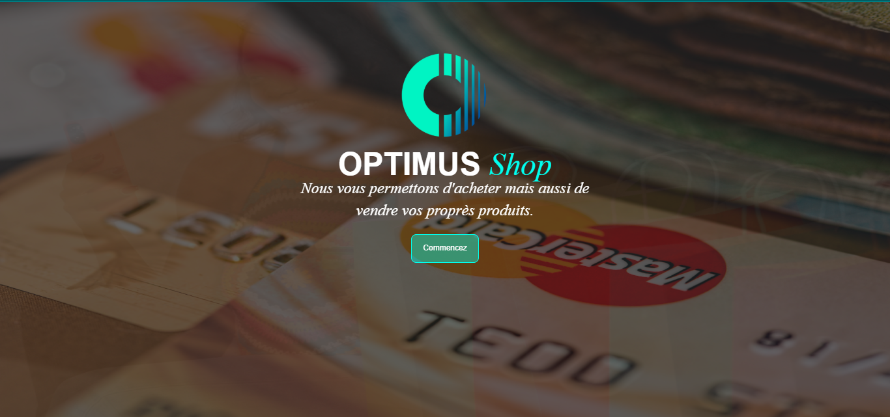
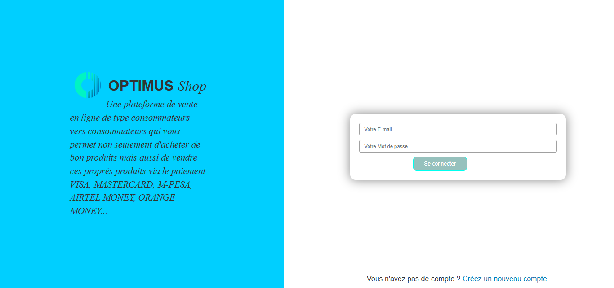
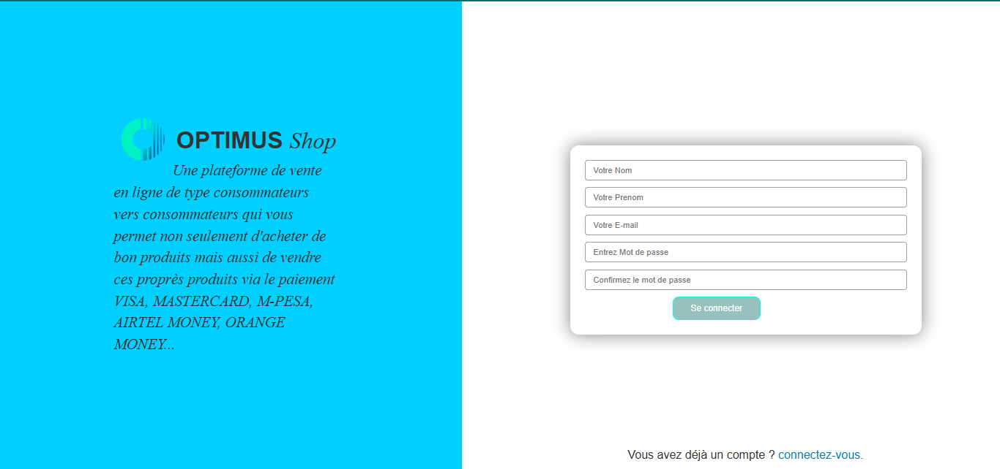
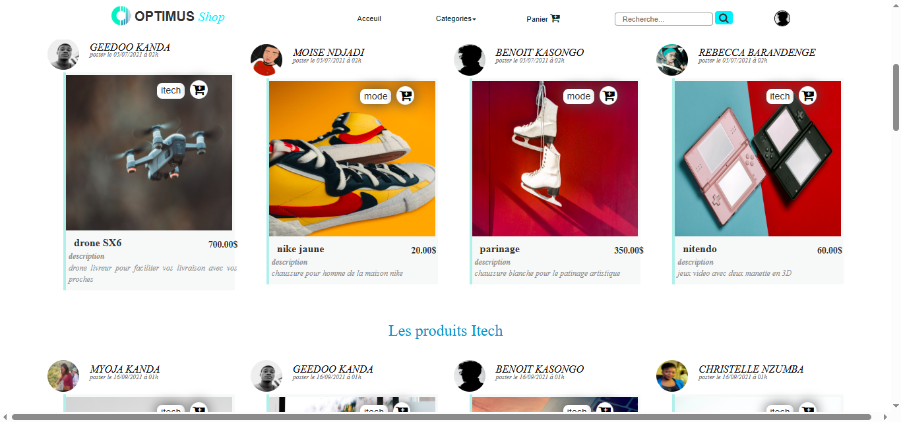
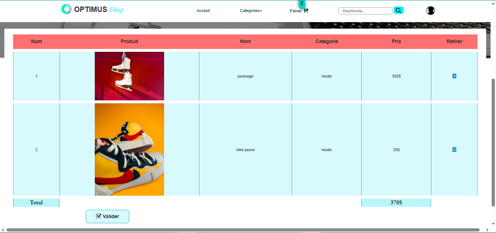
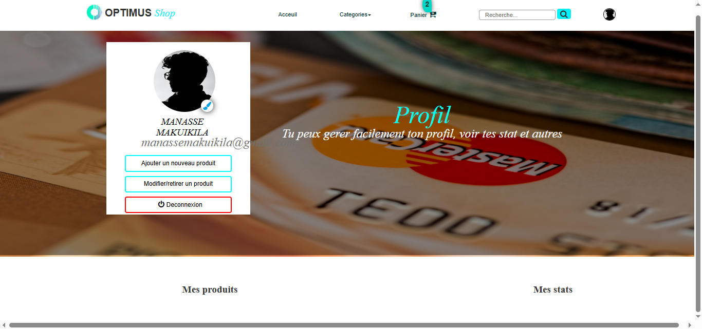
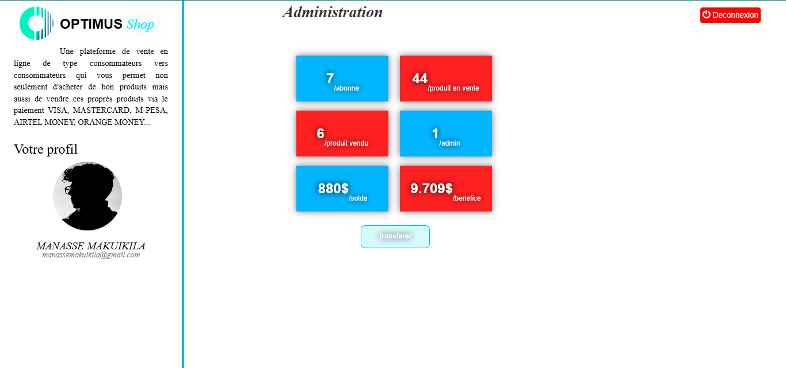

# 🛒 Optimus Shop

A full-stack e-commerce platform developed with PHP and MySQL.

Optimus Shop allows users to:
- Create an account
- Publish products for sale
- Browse products by category
- Add products to a shopping cart
- Manage their profile
- Access an administration dashboard

## Technologies

- PHP
- MySQL
- Bootstrap
- HTML5
- CSS3
- JavaScript

---

## Screenshots

### Landing Page


Page d'accueil présentant la plateforme Optimus Shop et son objectif : permettre aux utilisateurs d'acheter et de vendre leurs propres produits.

---

### Login Page


Authentification des utilisateurs via email et mot de passe.

---

### Registration Page


Création d'un nouveau compte utilisateur.

---

### Product Catalog


Catalogue principal affichant les produits mis en vente par les utilisateurs.

---

### Categories & Search


Navigation par catégories (Mode, Itech) et moteur de recherche intégré.

---

### Shopping Cart


Gestion du panier avec calcul automatique du total et validation de la commande.

---

### User Profile


Espace personnel permettant de gérer le profil et les produits publiés.

---

### Admin Dashboard


Interface d'administration avec statistiques, gestion des utilisateurs et des produits.
---

## Architecture

```
optimus-shop/
├── README.md
├── LICENSE
├── .gitignore
├── assets/                        # GitHub README screenshots
├── database/
│   └── schema.sql                 # Database structure (no demo data)
└── src/                           # Application source (deploy inside web root)
    ├── index.html                 # Login page
    ├── index_post.php             # Login handler
    ├── inscription.html           # Registration page
    ├── inscription_post.php       # Registration handler
    ├── home.php                   # Product catalog homepage
    ├── detail.php                 # Product detail page
    ├── search.php                 # Product search
    ├── panier.php                 # Cart page
    ├── addpanier.php              # Add to cart handler
    ├── userprod.php               # Product page linked to seller
    ├── users.php                  # Public user/seller profile
    ├── profil.php                 # Logged-in user profile
    ├── editer.php                 # Edit profile page
    ├── editer_post.php            # Edit profile handler
    ├── modif.php                  # Edit product page (seller)
    ├── modif_post.php             # Edit product handler
    ├── addproduit.php             # Add product page (seller)
    ├── addproduit_post.php        # Add product handler
    ├── deconnexion.php            # Logout handler
    ├── footer.php                 # Shared footer
    ├── bd.class.php               # Database connection (PDO)
    ├── session.class.php          # Session / auth class
    ├── panier.class.php           # Cart class (session-based)
    ├── admin/                     # Admin panel (status=1 users only)
    │   ├── index.php              # Admin dashboard
    │   ├── admin.php              # Admin menu
    │   ├── addproduit.php         # Add product (admin)
    │   ├── modif.php              # Edit product (admin)
    │   ├── users.php              # User list
    │   ├── adduser.php            # Add user
    │   ├── usermodif.php          # Edit user
    │   ├── vendu.php              # Sold products list
    │   ├── solde.php              # Discounted products
    │   ├── envente.php            # On-sale products
    │   └── editer.css             # Admin-specific styles
    ├── bootstrap/                 # Bootstrap 3 CSS + JS
    ├── css/                       # Custom stylesheets + Font Awesome
    ├── js/                        # JavaScript files
    └── img/
        ├── produits/              # Product photos (uploaded at runtime)
        ├── profil/                # Profile photos (uploaded at runtime)
        ├── optimus.png            # Logo
        └── f1.jpg … f4.jpg        # Hero/slider images
```

---

## Database

4 tables — full structure in [`database/schema.sql`](database/schema.sql).

| Table | Role |
|---|---|
| `users` | Customers and sellers. `status=1` = admin. Stores balance (`solde`) for peer-to-peer payments. |
| `produit` | Product catalog. Each product belongs to a seller (`id_users`). `etat` = `en vente` / `vendu` / `solde`. |
| `livre` | Order ledger. Stores buyer email, comma-separated seller IDs, comma-separated product IDs, total, transfer status. |
| `benefice` | Per-transaction profit record per seller, written when a payment succeeds. |

**Key relationship:** `users.id` ← `produit.id_users` (seller → product). The `livre` table links buyers and multiple sellers/products via CSV strings (denormalized).

---

## Features

### Customer side
- Product catalog homepage with category sections (latest, Itech, Mode)
- Full-text product search
- Product detail page with seller profile
- User registration and login (session-based)
- Session cart (add, view, checkout)
- User profile — edit bio, photo, bank account
- Peer-to-peer product listing (any user can sell)

### Admin side
- Dashboard with navigation menu
- Add / edit / delete products
- User management (add, edit)
- Inventory views: on-sale, sold, discounted
- Basic profit reporting (`benefice` table)

---

## Local Installation

### Requirements
- PHP 7.4+
- MySQL 5.7+
- WAMP, XAMPP or LAMP

### Steps

1. Copy the `src/` folder into your local server and rename it:

```
C:/wamp64/www/optimus-shop/
```

2. Create the database:

```sql
CREATE DATABASE optimus_shop;
```

3. Import the schema:

```
mysql -u root -p optimus_shop < database/schema.sql
```

4. Check the database connection in `src/bd.class.php`:

```php
private $host     = 'localhost';
private $username = 'root';
private $password = '';
private $database = 'optimus_shop';
```

5. Open the app:

```
http://localhost/optimus-shop/index.html    ← login
http://localhost/optimus-shop/home.php      ← catalog (requires login)
http://localhost/optimus-shop/admin/        ← admin (requires status=1)
```

6. Create an admin user directly in MySQL:

```sql
INSERT INTO users (nom_users, prenom_users, email, mot_passe, status)
VALUES ('Admin', 'Shop', 'admin@optimus.com', 'yourpassword', 1);
```

---

## Skills Demonstrated

- PHP backend development with OOP (PDO, session class, cart class)
- MySQL database design and CRUD operations
- Session-based authentication and access control
- Bootstrap 3 responsive UI
- Multi-role application: customer, seller, admin
- File upload handling (product and profile photos)
- Admin panel with inventory and sales views

---

## Notes

- Passwords are stored in plaintext — this is a learning project from 2021.
- The `livre` table uses comma-separated IDs (denormalized) — a normalized design would use a `commande_produit` join table.
- Images in `src/img/produits/` and `src/img/profil/` are user-generated at runtime and excluded from the repo via `.gitignore`.

---

## Author

**Manassé Makuikila Lusaku** — Applied Computer Science, 2021

## License

MIT License
