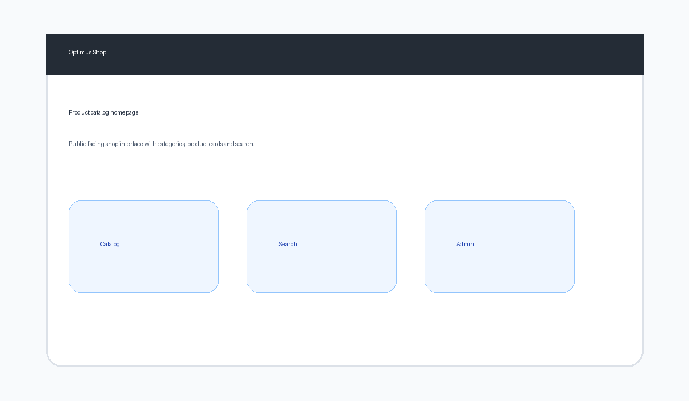
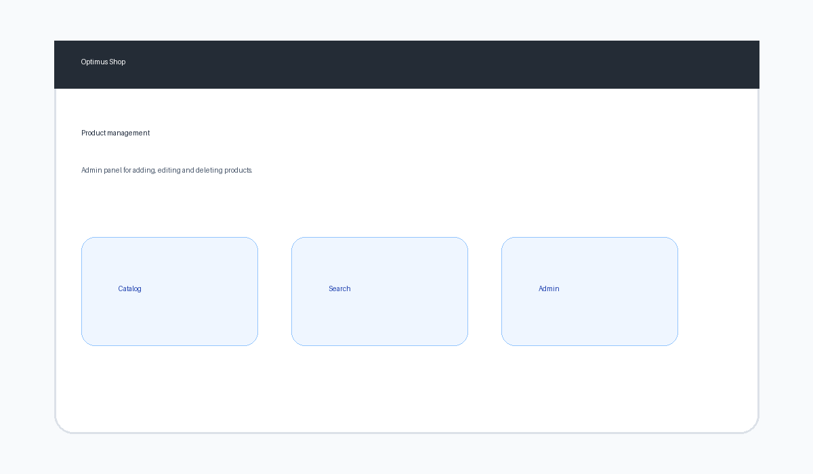
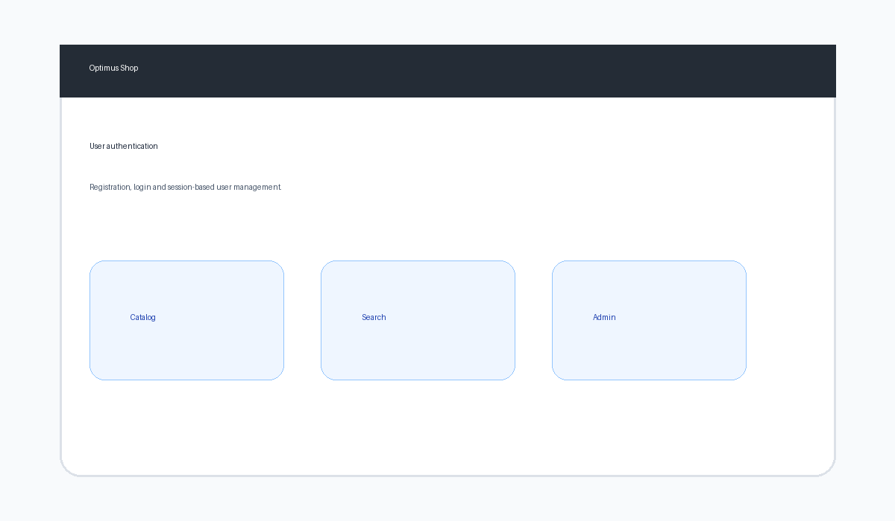

# Optimus Shop — E-Commerce Web Application

> Full-stack PHP/MySQL e-commerce platform with product catalog, user authentication, admin panel and responsive Bootstrap interface.

## Project Overview

**Optimus Shop** is a PHP/MySQL web application developed as a practical e-commerce project.  
It provides a public product catalog, product search, user registration/login, product detail pages, cart-related logic and an administration area for managing products and users.

**Context:** Web development project — Applied Computer Science, 2021.

## Preview







> Replace these preview images with real screenshots after running the project locally.

## Main Features

### Customer Side
- Product catalog homepage
- Product detail pages
- Product search
- User registration and login
- User profile page
- Session-based cart/user product tracking

### Admin Side
- Product management: add, edit, delete
- User management
- Inventory overview
- Basic sales/profit pages

## Technologies

| Category | Tools |
|---|---|
| Backend | PHP 7.x |
| Database | MySQL |
| Frontend | HTML5, CSS3, Bootstrap, JavaScript |
| Architecture | Object-oriented PHP classes |
| Server | Apache / WAMP / XAMPP |

## Project Structure

```text
optimus-shop/
├── README.md
├── LICENSE
├── .gitignore
├── assets/                  # GitHub README preview images
├── database/
│   └── schema.sql            # Public schema without personal/demo records
└── src/
    ├── home.php              # Product catalog homepage
    ├── detail.php            # Product detail page
    ├── search.php            # Product search
    ├── users.php             # User interface
    ├── userprod.php          # User product page
    ├── panier.php            # Cart page
    ├── bd.class.php          # Database connection class
    ├── session.class.php     # Session class
    ├── admin/                # Administration panel
    ├── bootstrap/            # Bootstrap files
    ├── css/                  # Custom stylesheets
    ├── js/                   # JavaScript files
    └── img/                  # Product/UI images
```

## Local Installation

### Requirements

- PHP 7.4+
- MySQL 5.7+
- WAMP, XAMPP or LAMP

### Steps

1. Copy the `src/` folder into your local web server directory and rename it:

```text
C:/wamp64/www/optimus-shop/
```

or on Linux:

```text
/var/www/html/optimus-shop/
```

2. Create a MySQL database:

```sql
CREATE DATABASE optimus_shop;
```

3. Import the schema:

```bash
mysql -u root -p optimus_shop < database/schema.sql
```

4. Check the database connection in:

```text
src/bd.class.php
```

Default local configuration:

```php
private $host = 'localhost';
private $username = 'root';
private $password = '';
private $database = 'optimus_shop';
```

5. Open the application:

```text
http://localhost/optimus-shop/home.php
```

Admin section:

```text
http://localhost/optimus-shop/admin/
```

## Public Repository Note

The original database dump contained demo records.  
For GitHub, the public `database/schema.sql` keeps the database structure only and excludes personal/demo data.

## Skills Demonstrated

- PHP backend development
- Object-oriented PHP
- MySQL database design
- CRUD operations
- Session management and authentication
- Bootstrap responsive interface
- Admin panel development
- E-commerce application logic

## Author

**Manassé Makuikila Lusaku**  
Applied Computer Science

## License

MIT License
