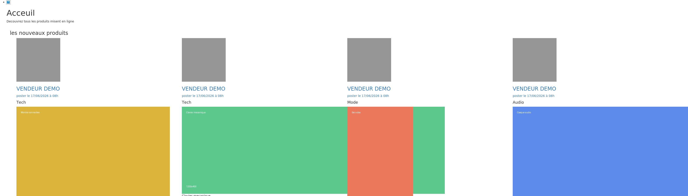
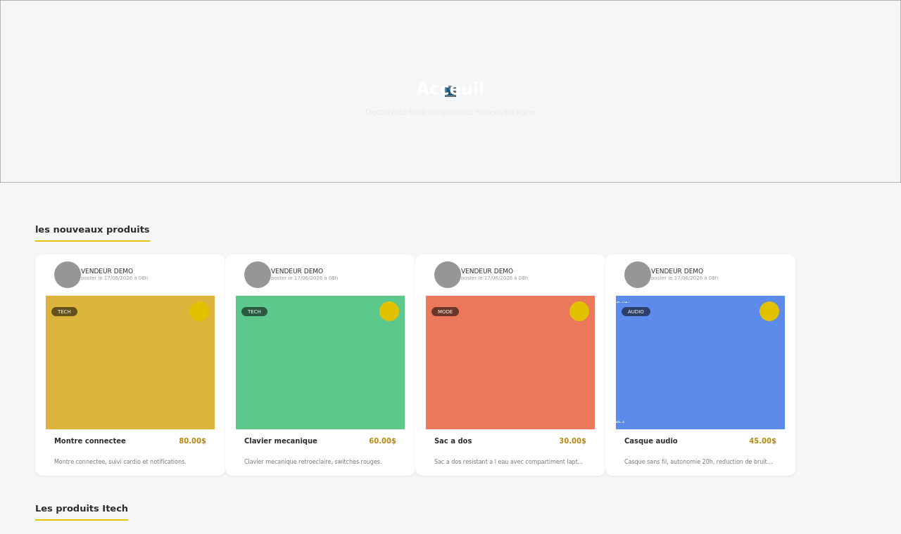

# Optimus Shop — E-Commerce Web Application

> Full-stack PHP/MySQL e-commerce platform with product catalog, user authentication, admin panel and responsive Bootstrap interface.

## Project Overview

**Optimus Shop** is a PHP/MySQL web application developed as a practical e-commerce project.  
It provides a public product catalog, product search, user registration/login, product detail pages, cart-related logic and an administration area for managing products and users.

**Context:** Web development project — Applied Computer Science, 2021.

## Preview

> The three images previously here (`assets/home_preview.png` etc.) were generic wireframe mockups, not real screenshots — see **Known Issue & Fix** below for why, and the before/after captures for what the real app looks like once fixed.

## Known Issue & Fix: product image display

**Root cause found:** the `css/` and `img/` folders referenced throughout `src/*.php` (`css/home.css`, `img/produits/*`, `img/profil/*`, …) were never committed to this repository — only the third-party `bootstrap/` library made it in. Without `home.css`, product `` tags render at their native size with no cropping, so a grid of products with different photo dimensions breaks completely:



A rebuilt `src/css/home.css` is now included in this repo (object-fit cropping, fixed-size cards, responsive flex grid, avatar styling). Same data, same markup, only the stylesheet added:



**What you still need to do:** this fixes the *display logic*, but the actual missing files — your real product photos in `img/produits/`, profile pictures in `img/profil/`, and the other page-specific stylesheets (`addproduit.css`, `profil.css`, `panier.css`, `search.css`, `users.css`, `inscription.css`, `acceuil.css`, `style.css`) — are still absent from the repo. Check your local machine (old XAMPP/WAMP `htdocs` folder, or wherever you last ran this project) for a `css/` and `img/` folder next to `src/`; if you find them, just `git add` and push them. If they're genuinely lost, send me the page(s) you want styled next (a screenshot of the page or the relevant `.php` file is enough) and I'll write the matching CSS the same way I did for `home.css`.

## Main Features

### Customer Side
- Product catalog homepage
- Product detail pages
- Product search
- User registration and login
- User profile page
- Session-based cart/user product tracking

### Admin Side
- Product management: add, edit, delete
- User management
- Inventory overview
- Basic sales/profit pages

## Technologies

| Category | Tools |
|---|---|
| Backend | PHP 7.x |
| Database | MySQL |
| Frontend | HTML5, CSS3, Bootstrap, JavaScript |
| Architecture | Object-oriented PHP classes |
| Server | Apache / WAMP / XAMPP |

## Project Structure

```text
optimus-shop/
├── README.md
├── LICENSE
├── .gitignore
├── assets/                  # GitHub README preview images
│   └── fix_demo/            # before/after captures for the image-display fix
├── database/
│   ├── schema.sql            # Public schema without personal/demo records
│   └── seed_demo.sql         # Fictional demo data used for the before/after captures
└── src/
    ├── home.php              # Product catalog homepage
    ├── detail.php            # Product detail page
    ├── search.php            # Product search
    ├── users.php             # User interface
    ├── userprod.php          # User product page
    ├── panier.php            # Cart page
    ├── bd.class.php          # Database connection class
    ├── session.class.php     # Session class
    ├── admin/                # Administration panel
    ├── bootstrap/             # Bootstrap files
    ├── css/                  # Custom stylesheets — currently only home.css is committed,
    │                          #   the rest (addproduit.css, profil.css, panier.css, search.css,
    │                          #   users.css, inscription.css, acceuil.css, style.css) are missing,
    │                          #   see "Known Issue & Fix" above
    ├── js/                   # JavaScript files
    └── img/                  # Product/UI images — currently empty, see "Known Issue & Fix"
```

## Local Installation

### Requirements

- PHP 7.4+
- MySQL 5.7+
- WAMP, XAMPP or LAMP

### Steps

1. Copy the `src/` folder into your local web server directory and rename it:

```text
C:/wamp64/www/optimus-shop/
```

or on Linux:

```text
/var/www/html/optimus-shop/
```

2. Create a MySQL database:

```sql
CREATE DATABASE optimus_shop;
```

3. Import the schema (and optionally the demo data used for the screenshots above):

```bash
mysql -u root -p optimus_shop < database/schema.sql
mysql -u root -p optimus_shop < database/seed_demo.sql   # optional, fictional demo data
```

4. Check the database connection in:

```text
src/bd.class.php
```

Default local configuration:

```php
private $host = 'localhost';
private $username = 'root';
private $password = '';
private $database = 'optimus_shop';
```

5. Open the application:

```text
http://localhost/optimus-shop/home.php
```

Admin section:

```text
http://localhost/optimus-shop/admin/
```

## Public Repository Note

The original database dump contained demo records.  
For GitHub, the public `database/schema.sql` keeps the database structure only and excludes personal/demo data.

## Skills Demonstrated

- PHP backend development
- Object-oriented PHP
- MySQL database design
- CRUD operations
- Session management and authentication
- Bootstrap responsive interface
- Admin panel development
- E-commerce application logic

## Author

**Manassé Makuikila Lusaku**  
Applied Computer Science

## License

MIT License
